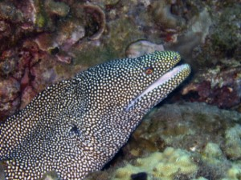
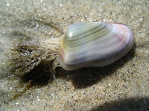
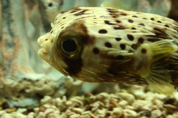
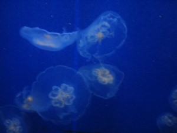

# DLMarines 
**Team**: Bartosz Brzoza, Magdalena Buszka, Martyna Firgolska, Michał Kulibiński

**Description**: This project contains simple workflow for classification of images of marine animals, leveraging kedro framework. It was made as a student project for "Projeect: Deep Learning" course at University of Wrocław.

### Dataset
The dataset contains images of marine animals - 23 different classes (Seahorse, Nudibranchs, Sea Urchins, Octopus, Puffers, Rays, Whales, Eels, Crabs, Squid, Corals, Dolphins, Seal, Penguin, Starfish, Lobster, Jelly Fish, Sea Otter, Fish, Shrimp and Clams). Each image size is of the type (k, 300px) or (300px, k), where k is a number less or equal to 300. 
Example images:










## How to use:
Begin by downloading the repository by cloning it or downloading the zip to the directory of your choice and openig the repo's folder.

### Installation:
To install the environment run the commands below
```bash
conda env create  --file conda.yml
conda activate dlmarines
poetry install
```

### Data downloading
You can download data manually from https://www.kaggle.com/datasets/vencerlanz09/sea-animals-image-dataste into [data/01_raw](./data/01_raw) or use data_downloading pipeline by running
```
kedro run --pipeline=data_downloading
```
Note that the pipeline uses kaggle api, so in order to run it follow the steps below to download your kaggle key. 

Read more about  [data downloading pipeline](./src/dlmarines/pipelines/data_downloading/README.md).

**Download Kaggle Api Key**:
1. Sign in to [kaggle](https://www.kaggle.com/)
2. Go to Account
3. Go to API section and click `Create New API Token`. It will download `kaggle.json` with your username and key.
```json
{ "username":"your_kaggle_username","key":"123456789"}
```
4. In `conf/local/credentials.yml` add your username and key as shown below:
```yml
kaggle:
      username: "your_kaggle_username"
      key: "123456789"
```
### Data preprocesing
To preprocess data from [/data/01_raw/sea-animals-image-dataste.zip](./data/01_raw/sea-animals-image-dataste.zip) use data_processing pipeline
```
kedro run --pipeline=data_processing
```
Read more about  [data preprocessing pipeline](./src/dlmarines/pipelines/data_processing/README.md).

### Model training
To train the model use model_training pipeline
```
kedro run --pipeline=model_training
```
Read more about  [model training pipeline](./src/dlmarines/pipelines/model_training/README.md).

### Model evaluation 
To evaluate the model use model_evaluation pipeline
```
kedro run --pipeline=model_evaluation
```
Read more about  [model evaluation pipeline](./src/dlmarines/pipelines/model_evaluation/README.md).

### Running:
To run all pipelines you can use command:
```
kedro run
```
Remember that in order to automatically download dataset you need to add your kaggle key.

## About the project

### Weights&Biases
Here you can view the [Weights&Biases 
report](https://wandb.ai/dlmarines/dlmarines_public/reports/DL-Marines-Model-Report--Vmlldzo0MTg4NDI3)

### Documentation
Detailed documentation can be found [here](https://mfirgo.github.io/dlmarines/)

### Libraries and technologies
The technologies and main libraries used in the project:
* [Kedro](https://kedro.org/) - for project framework and structure
* [mkdocs](https://www.mkdocs.org/) - for documentation
* [Poetry](https://python-poetry.org/) -  for managing dependencies
* [PyTorch]()
* [Lightning]() - for easy implementation of models and training
