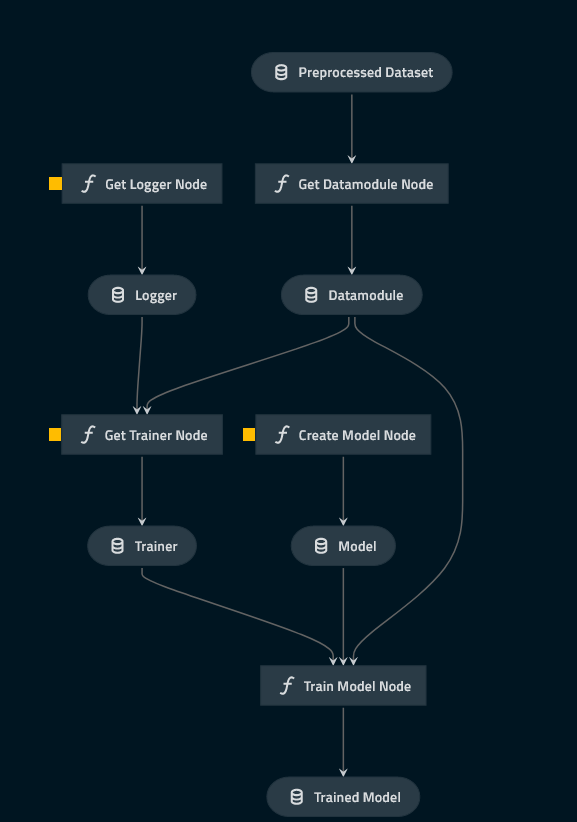

# Pipeline model_training

## Overview

This pipeline creates DataModule form PreprocessedDataset, as well as creates Logger and Model from parameters defined in [model_training.yml](./../../../../conf/base/parameters/model_training.yml). It then makes the Trainer using Datamodlue and Logger, after which it uses it to train the model. The train-test split is performed inside the DataModule.

## Pipeline inputs

* PreprocessedDataset - dataset outputed by data_processing pipeline
* Training parameters -  parameters defining the training
* model parameters - parameters defining the structure of the model
* logger parameters - parameters defining the wndb project for which to log

## Pipeline outputs

* trained model - model after trianing, 
